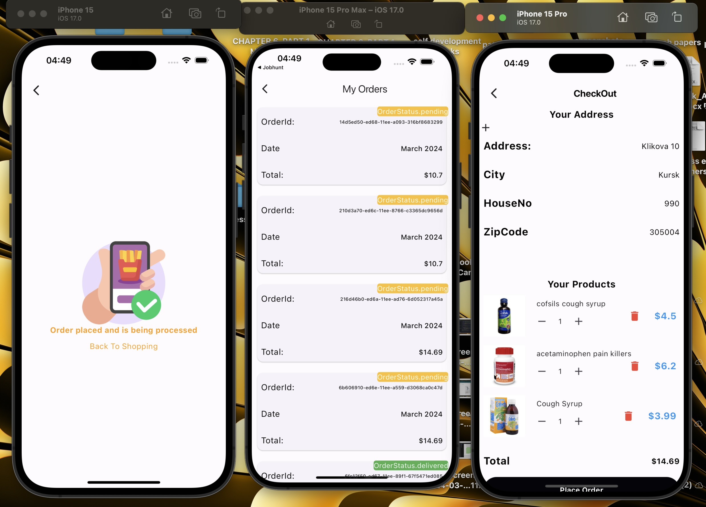

# Flutter eCommerce Application With Firebase ,Riverpod & Stripe Payment Gateway for a Phamarcy Store
<h1></h1> This project is based on an imaginary phamarcy store that wants to expand their operations by launching a mobile application so that they can sell their goods online.To help the phamarcy store an assessment was carried out and a cross platform mobile application was developed for the store , an agreement was reached to use firebase for the backend because firebase allows developers to launch an M.V.P fast in combination with flutter , which reduces the time for the product to hit the market <h1/>

<h2>App Features </h2>
<ol>
<li>Display products</li>
<li>Product categories</li>
<li>Related products</li>
<li>Adding products to wishlist</li>
<li>User profile</li>
<li>Add poducts to cart</li>
<li>Checkout</li>
<li>Add ,edit address</li>
<li>Stripe paymentspayment by card , apple pay & google pay)</li>
<li>Orders (track pending , order history )</li>
</ol>

## Getting Started
<h1>To get started make sure you clone this project , then create a new firebase project on firebase console  </h1>
<ol>
  <li>If you haven't already, install the Firebase CLI.</li>
  <li>Log into Firebase using your Google account by running the following command:firebase login</li>
  <li>Install the FlutterFire CLI by running the following command from any directory:dart pub global activate flutterfire_cli</li>
  <li>Use the FlutterFire CLI to configure your Flutter apps to connect to Firebase.

From your Flutter project directory, run the following command to start the app configuration workflow:flutterfire configure</li>
<li>From your Flutter project directory, run the following command to install the core plugin:flutter pub add firebase_core</li>
<li>From your Flutter project directory, run the following command to ensure that your Flutter app's Firebase configuration is up-to-date:flutterfire configure</li>
<li>Run flutter pub get to get all dependencies</li>
</ol>

<h1>Youtube Channel</h1>
<a href="https://www.youtube.com/channel/UCGfU4kZ0QHYriCMLhBoC1aA">Youtube </a>
<h2>You can support my work by buying me a coffee below</h2>

